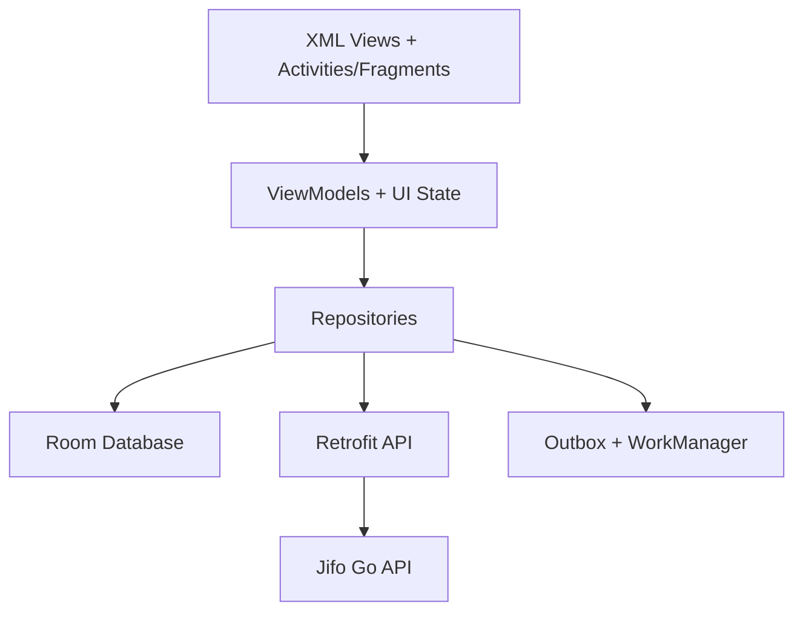

# Jifo Android App Design

## Goal

Build a native Android app that implements the existing Jifo Web functionality with matching visual style, Kotlin implementation, XML View-based UI, high-performance native note list rendering, and full offline-first sync.

## Context

Jifo currently has:

- Go backend with auth, notes, tags, heatmap, media, access keys, and sync endpoints.
- React Web app with Flomo-like note layout, sidebar, editor, tag tree, heatmap, settings, and IndexedDB outbox/sync.
- CLI client.
- No existing Android project.

The Android work will add a new `android/` project without restructuring `backend/`, `web/`, or `cli/`.

## Requirements

### Functional Scope

Android v1 must align with the existing Web app:

- Login and register.
- Token persistence and refresh.
- Note list, create, edit, delete, and restore through the existing notes and sync APIs.
- Search notes.
- Filter by tag.
- Sidebar/drawer with user name, stats, heatmap, all notes, tag tree, settings, and logout.
- Settings/access key management: list, create with one-time secret display, delete.
- Offline-first note storage and sync using Room, outbox, and WorkManager.
- Conflict handling that creates conflict notes instead of overwriting.

### UI Requirements

The Android UI must match the approved v2 mobile direction:

- Top app row contains, from left to right:
  - three-line menu button,
  - Jifo logo and text,
  - search icon.
- Menu and search buttons have no visible background.
- Top bar is compact.
- Home page does not show an additional `全部笔记` title row or `notes` count row.
- Note list starts directly below the top bar.
- Note list uses native XML `RecyclerView` for performance.
- Bottom-center FAB is yellow, smaller than the first mockup, circular, and uses a white plus icon.
- Tapping FAB opens a bottom sheet note input.
- The bottom sheet editor:
  - has no title text,
  - has no `离线可写` hint,
  - uses an input background consistent with the outer sheet,
  - has no input border,
  - uses compact padding,
  - has an icon-only send button,
  - disables and greys the send button when content is empty.
- Drawer content mirrors the Web left sidebar, with Android adjustments:
  - user name is vertically centered,
  - no app icon to the left of the name,
  - no `已同步` text.

### Visual Style

Use Web CSS variables as the source for Android resources:

- Background: `#f5f0e8`.
- Soft card: `#fffdf8` / translucent equivalents where native Android supports them.
- Ink: `#201b16`.
- Muted: `#817568`.
- Green: `#3d7c4a`.
- Green dark: `#26382b`.
- Amber/FAB: `#e8b85b`.
- Danger: `#a94438`.
- Rounded cards and pills should visually match Web radii.

## Architecture

Add a standard native Android project under `android/`.



### Main Areas

- `MainActivity`: app shell, login-state routing, theme setup, and navigation host.
- `auth`: login/register, token storage, refresh-token flow, session clearing.
- `notes`: `RecyclerView` list, note card rendering, create/edit/delete, tag highlighting, divider rendering.
- `drawer`: stats, heatmap, all notes, tag tree, settings/logout entry points.
- `settings`: access key list/create/delete and one-time secret display.
- `sync`: Room outbox, push/pull coordination, WorkManager scheduling.
- `design`: colors, shapes, drawables, styles, reusable XML components.

## Data and API Design

### Remote API

Use existing backend endpoints:

- `POST /auth/login`
- `POST /auth/register`
- `POST /auth/refresh`
- `GET /notes`
- `GET /notes/stats`
- `POST /notes`
- `PATCH /notes/{id}`
- `DELETE /notes/{id}`
- `POST /notes/{id}/restore`
- `GET /tags/tree`
- `GET /heatmap`
- `GET /settings/access-keys`
- `POST /settings/access-keys`
- `DELETE /settings/access-keys/{id}`
- `POST /sync/push`
- `GET` or `POST /sync/pull`

The Android client should support a configurable base URL for local development. For emulator development, default to `http://10.0.2.2:8080/api`.

### Local Room Tables

- `notes`
  - server ID, client ID, content JSON, plain text, created/updated timestamps, version, deleted state, pending sync state.
- `tags`
  - id, name, path, parentId, depth, noteCount.
- `heatmap_days`
  - date, createdCount, updatedCount, totalCount.
- `outbox_operations`
  - opId, entity, action, noteId, clientId, baseVersion, payload JSON, status, retryCount, lastError, createdAt.
- `sync_state`
  - pull cursor and current sync run metadata used to recover interrupted sync work.
- `auth_session`
  - accessToken, refreshToken, user info, deviceCode.

## Offline-First Sync

### Local Operations

For create/update/delete/restore:

1. Write the local note change into Room inside a transaction.
2. Insert an outbox operation in the same transaction.
3. Update UI from Room immediately.
4. Schedule sync using WorkManager.
5. Retry failed operations on future sync attempts.

### Sync Flow

1. Restore interrupted `syncing` operations to retryable failed/pending state.
2. Push outbox operations in `createdAt`/sequence order.
3. Process push results:
   - `created`, `updated`, `deleted`, `restored`, `duplicate`: update local IDs/versions/status and clear outbox.
   - `conflict_copied`: clear outbox for that operation and rely on pull to store the conflict copy.
   - `delete_conflict_ignored`: clear outbox and rely on pull for the server state.
   - unknown/failure: mark outbox failed with `lastError`.
4. Pull remote changes using cursor.
5. Upsert remote notes if the local note does not have pending local operations.
6. Update tags, stats, and heatmap after sync or explicit refresh.

## Conflict Handling

Backend already contains conflict-copy behavior in `backend/internal/sync/service.go` via `createConflictCopyTx`.

When an update/restore operation has stale `baseVersion`, the server creates a new note instead of overwriting the original. The implementation should adjust the backend conflict prefix to exactly:

```text
此条笔记冲突
```

The conflict note content should be:

1. `paragraph`: `此条笔记冲突`
2. `divider`
3. the client's submitted blocks

The conflict note `plainText` should be:

```text
此条笔记冲突

----
<client submitted plainText>
```

Android behavior for `conflict_copied`:

- Do not overwrite the original note.
- Clear the outbox operation as handled.
- Pull and store the server-created conflict note.
- Render `divider` blocks as thin separators in note cards and in the edit preview shown before submitting.

This keeps conflict behavior centralized in the backend and consistent across Web and Android.

## UI Details

### Main Screen

- `DrawerLayout` root.
- Main content includes compact top bar, note `RecyclerView`, and bottom-center FAB.
- No separate page-title row.
- `RecyclerView` adapter uses stable IDs where possible and `ListAdapter`/`DiffUtil`.
- Infinite loading follows existing Web page size of 20 for remote list refresh, while local display is Room-backed.

### Note Card

- Shows timestamp.
- Shows paragraph blocks and image attachments; if an image cannot load, shows the block alt text or media URL fallback.
- Renders `#tags` with purple tag styling matching Web.
- Renders `divider` as a horizontal separator.
- Supports overflow menu for edit/delete.
- Supports collapsed long content and expand/collapse.

### Drawer

- User name row only; centered vertically.
- Stats row: notes, tags, active days.
- Heatmap grid.
- All notes pill.
- Nested tag tree with expand/collapse.
- Settings and logout access.

### Search

- Search icon switches the top bar into search mode.
- Search query debounces before updating the Room-backed list and remote refresh parameters.
- Closing search clears the active query.

### Note Editor Bottom Sheet

- `BottomSheetDialogFragment`.
- Borderless `EditText`/text input area.
- Compact padding.
- Small icon-only send button.
- Disabled/grey state when trimmed content is empty.

## Testing Strategy

Use TDD for behavior changes.

### Android Tests

- Repository tests:
  - auth payloads,
  - token refresh and retry,
  - create/update/delete writes Room and outbox transactionally,
  - operations include correct `baseVersion`,
  - `conflict_copied` clears outbox and does not overwrite original.
- Room DAO tests:
  - ordering by creation time,
  - search,
  - tag filtering,
  - sync status persistence,
  - pull does not overwrite pending local notes.
- SyncWorker tests:
  - push before pull,
  - success updates IDs/versions,
  - failure retains retryable outbox,
  - conflict copy arrives through pull.
- UI tests:
  - top bar structure,
  - drawer opens and shows stats/heatmap/tags,
  - FAB opens editor bottom sheet,
  - empty editor disables send,
  - content enables send and creates local note,
  - search and tag filter update list.

### Backend Tests

- Add/update tests for `createConflictCopyTx` behavior:
  - conflict note starts with `此条笔记冲突`,
  - second block is `divider`,
  - `plainText` uses `此条笔记冲突\n\n----\n...`.

### Regression Commands

- `cd backend && go test ./...`
- `cd web && npm test -- --run`
- `cd web && npm run build`
- `cd android && ./gradlew testDebugUnitTest`
- `cd android && ./gradlew assembleDebug`

## Acceptance Criteria

- Android project builds in `android/`.
- App uses Kotlin and XML View system.
- Note list is native `RecyclerView`.
- UI matches approved v2 mobile design.
- Full Web feature scope is represented in Android.
- Offline create/edit/delete works locally and syncs when network is available.
- Conflict notes are created with `此条笔记冲突` + divider prefix.
- Backend/Web regressions pass after conflict wording changes.
