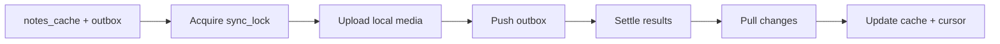

# Jifo 同步协议

Jifo 同步采用离线优先思路：Web 先写 IndexedDB 本地缓存与 outbox；网络可用时按顺序同步到后端，再 pull 远端变更刷新本地缓存。

> 当前状态：后端 `internal/sync.Service` 和 Web `syncEngine` 已实现核心协议与测试；但 `/api/sync/push` HTTP handler 仍是占位返回 `501 not_implemented`，尚未把 service 完整接入 HTTP API。

## IndexedDB schema

Web 本地数据库由 `web/src/storage/db.ts` 定义，使用 Dexie。

```ts
notes_cache: 'id, clientId, updatedAt, deletedAt, permanentlyDeletedAt'
media_cache: 'id, localId, serverId, status'
outbox: '++localSeq, opId, entity, action, createdAt, status'
sync_state: 'key'
```

### notes_cache

保存本地 note 快照：

```ts
type CachedNote = {
  id: string;
  clientId: string;
  blocks: CachedNoteBlock[];
  createdAt?: string;
  updatedAt: string;
  deletedAt?: string | null;
  permanentlyDeletedAt?: string | null;
  version?: number;
  conflictOfNoteId?: string;
  conflictReason?: string;
};
```

### media_cache

保存本地媒体引用和服务端上传结果：

```ts
type CachedMedia = {
  id: string;
  localId?: string;
  serverId?: string;
  status: 'local_pending' | 'uploaded' | 'failed' | string;
  blob?: Blob;
  createdAt: string;
};
```

### outbox

每个离线操作会写入 outbox：

```ts
type OutboxOperation = {
  localSeq?: number;
  opId: string;
  entity: 'note' | 'media';
  action: 'create' | 'update' | 'delete' | 'restore';
  noteId?: string;
  clientId: string;
  baseVersion: number;
  payload: { blocks?: CachedNoteBlock[]; [key: string]: unknown };
  createdAt: string;
  status: 'pending' | 'pushing' | 'failed';
  lastError?: string;
};
```

要求：

- `opId`：操作幂等键。
- `clientId`：客户端侧 note 标识/设备内去重标识。
- `baseVersion`：客户端发起 update/delete/restore 时看到的版本，用于冲突判断。
- `localSeq`：自增队列序号，保证本地顺序 push。

## 离线新增 note

`createOfflineNote(db, input)` 会在一个 IndexedDB 事务中：

1. 写入 `notes_cache`。
2. 写入 `outbox` 的 `create` 操作。

这样可以避免“本地已经显示但没有同步任务”的中间态。

## 同步流程

`runSync()` 顺序：

1. 获取同步锁。
2. 恢复上次中断遗留的 `pushing` 操作为 `failed + interrupted_sync`。
3. 读取 `pending/failed` outbox，按 `localSeq` 排序。
4. 标记本批为 `pushing`。
5. 媒体优先上传。
6. `pushOutbox()` 推送 note 操作。
7. 根据 push result 清理或保留 outbox。
8. `pullChanges(cursor)` 拉取远端变更。
9. 写入 `notes_cache` 和 `sync_state.cursor`。
10. 释放同步锁。



## 媒体先上传规则

如果 note blocks 中存在本地图片引用：

```ts
{ type: 'image', url: 'blob:...', localId: 'local-media-1' }
```

同步时先调用 `uploadMedia({ localId, url })`。成功后：

1. 更新 `media_cache.serverId/status`。
2. 将 outbox payload 持久化改写为：

```ts
{ type: 'image', mediaId: 'server-media-1' }
```

如果上传成功但 push 失败，下一次重试会复用已持久化的 `mediaId`，避免重复上传同一媒体。

## Push result 状态

前端视为成功并清理 outbox 的状态：

- `created`
- `updated`
- `deleted`
- `restored`
- `duplicate`
- `conflict_copied`
- `delete_conflict_ignored`

未知或失败状态会保留 outbox 为：

```ts
{ status: 'failed', lastError: 'push_status:<status>' }
```

抛异常时也会保留 outbox 为 `failed + lastError`。

## duplicate

后端 create 幂等冲突会返回：

```json
{ "status": "duplicate", "noteId": "server-note-id", "version": 2 }
```

前端会把明确 `op.noteId` 对应的本地 note id/version 回填为服务端 note id/version，并清理 outbox。

## conflict_copied

当 update/restore 的 `baseVersion` 过旧，后端会创建冲突副本并返回：

```json
{ "status": "conflict_copied", "noteId": "conflict-note-id", "version": 3 }
```

前端规则：

- 不把原 note id 改成冲突副本 id。
- 如果 push result 直接带 `note`，写入 `notes_cache`。
- 否则依赖后续 `pullChanges` 拉取冲突副本并写入缓存。

冲突副本内容由后端前置提示：

```text
这是一条冲突副本，原笔记已在其他设备被更新。

----
<客户端提交内容>
```

## delete 冲突忽略

当 delete 的 `baseVersion` 过旧，后端返回：

```json
{ "status": "delete_conflict_ignored", "noteId": "...", "version": 5 }
```

前端视为该 outbox 已处理，清理本地 outbox，并等待 pull 获取服务端最终状态。

## Pull cursor

前端 cursor 形状：

```ts
{ updatedAt: string; id: string }
```

后端 service cursor 为 `(updatedAt, id)`，按 `(updated_at, id)` 递增拉取。Web 会在 `sync_state` 中保存：

```ts
{ key: 'cursor', value: { updatedAt: '2026-05-27T...', id: 'note-id' } }
```

## 同步锁

Web sync engine 使用两层锁：

1. 进程内 `runningSyncDbNames`，防止同一个 JS 上下文重复运行同名 DB sync。
2. IndexedDB `sync_state.sync_lock`，保存 `{ owner, expiresAt }`，减少多个 `JifoDb` 实例/多上下文同时同步。

锁会在 push/pull 阶段前续租校验。若锁丢失，同步会抛错并把本轮 `pushing` 操作回退为 `failed`。
